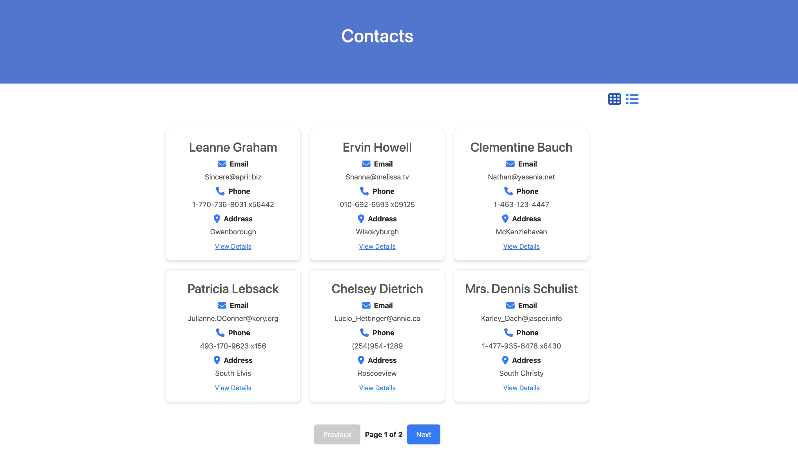
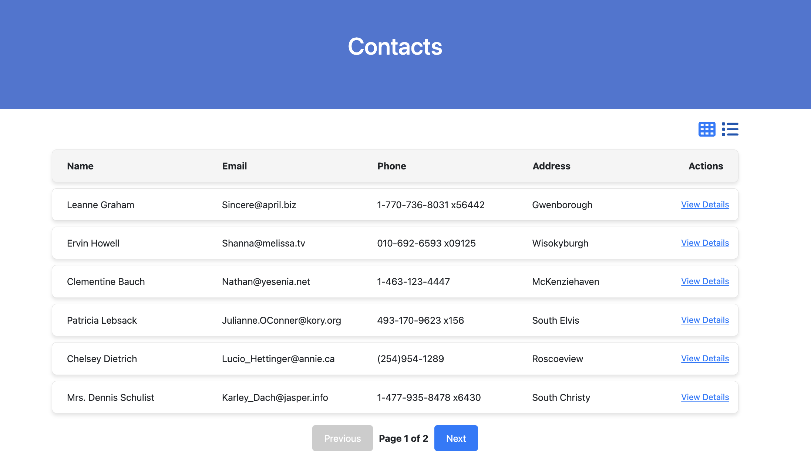
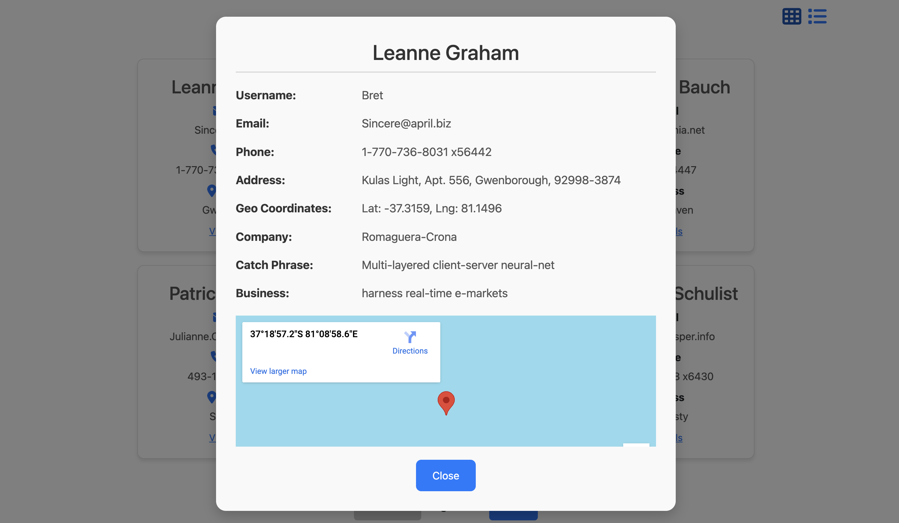

# Contact Viewer Application

## Introduction
The Contact Viewer Application is a simple yet powerful React-based app for browsing and managing contact details. The main page allows users to switch between two views: **Grid View** and **List View**, providing flexibility in how contact information is displayed.

### Features of the Main Page:
1. **Grid View**: Displays contacts in a card-style layout, ideal for a quick overview.
2. **List View**: Displays contacts in a table-like row layout, perfect for detailed comparison.
3. **View Details**: Click the "View Details" button for any contact to see their additional information in a popup modal. The modal includes:
     - **Username, Email, Phone, and Address** details.
     - **Company Information**, such as the company name and catchphrase.
     - A **Google Map** displaying the contact's location based on their geographical coordinates.
4. **Pagination**: Navigate through pages using the controls at the bottom.

**Grid View**:


**List View**:


**View Details Popup Modal**


---

## Prerequisites

Make sure you have the following installed on your system:

1. **Node.js** (Download from [Node.js Official Website](https://nodejs.org))
   - Verify installation by running:
     ```bash
     node -v
     npm -v
     ```

2. **npm** (Node Package Manager) or **yarn** (Optional)

3. A modern web browser like **Google Chrome**, **Firefox**, or **Edge**.

4. (Optional) A code editor such as **Visual Studio Code**.

---

## Installation Instructions

### 1. Clone the Repository
First, clone the project repository to your local system:
```bash
git clone https://github.com/zhlu4172/component_contacts.git

```
---

### 2. Setup and Run the Application

#### Step 1: Navigate to the Project Directory
Go into the project folder:
```bash
cd contacts-app
```

#### Step 2: Install Dependencies
Install the required packages by running:
```bash
npm install
```

This will install all the dependencies listed in the `package.json` file.

#### Step 3: Start the Development Server
Run the following command to start the app in development mode:
```bash
npm start
```

This will open the application in your default browser at [http://localhost:3000](http://localhost:3000).

---

## Building for Production

To create a production-ready build of the application, use the following command:
```bash
npm run build
```

This will create a `build` folder in the project directory, containing an optimized version of the app.

---

## Troubleshooting

1. **Missing Dependencies**: Ensure you have run `npm install` to install all dependencies.
2. **Port Conflicts**: If port `3000` is in use, you can specify a new port using:
   ```bash
   PORT=4000 npm start
   ```
   Replace `4000` with your desired port.

3. **Outdated Node.js**: Make sure you are using a recent and stable version of Node.js (LTS is recommended).

---

## Included Packages

This project uses the following key packages:
- **React**: For building the user interface.
- **Axios**: For API requests.
- **Font Awesome**: For icons in the UI.

---

## API Source

This project uses dummy data from [JSONPlaceholder](https://jsonplaceholder.typicode.com) for contact information.

---

## License

This project is licensed under [MIT License](LICENSE).
